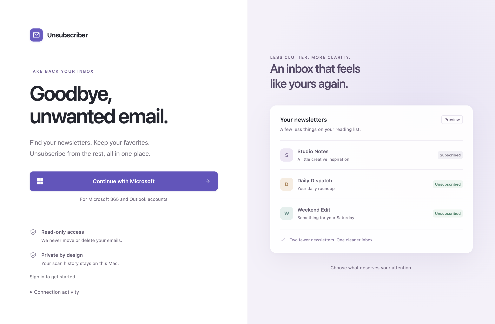

# Newsletter Unsubscriber for Mac

A desktop app for finding newsletters in your Microsoft mailbox and unsubscribing
from the ones you no longer want. Built with Electron and TypeScript.

**Status:** source distribution for local development. macOS is the primary target.
There are no signed or notarized releases provided by this repository. Microsoft
sign-in requires your own public-client app registration.



## Features

- Scan selected mail folders for newsletter unsubscribe headers.
- Search results and filter by status.
- Unsubscribe individually or in bulk with supported one-click requests.
- Pause bulk requests for a sender domain after a failure; continue other domains.
- See domain summaries and a plain-language Activity log with request timing,
  destinations, HTTP results, and the one-click POST body.
- Keep scan history locally; no analytics or developer-operated backend.

## Quick start

Prerequisites: macOS, **Node.js 22.16 or newer in the Node 22 LTS line**, npm, and a
Microsoft account with a mailbox supported by Microsoft Graph. Your organization
may require administrator approval for mail access.

```sh
npm ci
cp .env.example .env
```

Create a Microsoft Entra application registration following
[Microsoft account setup](docs/MICROSOFT_SETUP.md), then fill in `.env`:

```dotenv
AZURE_CLIENT_ID=your-application-client-id
AZURE_TENANT_ID=your-directory-tenant-id
```

These are public-client identifiers, not passwords. Nevertheless, keep your own
configuration local. **Do not create or add a client secret.**

```sh
npm run dev
```

The app opens without a developer-tools window. Use **Continue with Microsoft**,
open Microsoft's verification page, and enter the displayed code. Then select
**Mail folders**, choose folders, and scan. **Activity** shows requests as they run;
connection activity is also available before sign-in.

For a packaged app, configure `config.json` in the app's user-data directory as
described in [setup](docs/MICROSOFT_SETUP.md). Development `.env` files are not bundled.

## How unsubscribe works

A result represents a sender address plus its mailing-list ID (`List-ID`), or its
first unsubscribe URL when no list ID is present. A row displaying “9 messages”
represents nine grouped messages, not nine requests. Message-specific URLs can
still produce duplicate-looking rows. Separate lists on one domain remain separate.

- **One-click HTTPS link:** sends `POST` with content type
  `application/x-www-form-urlencoded` and body `List-Unsubscribe=One-Click`.
  A successful server response is recorded as “Unsubscribed”; this means the request
  was accepted, not that the sender's future delivery behavior was verified.
- **Other HTTPS links:** opens your browser. Complete the sender's steps, then use
  **Mark as unsubscribed**.
- **Email links:** opens your email app. Review and send the request yourself.
- Insecure HTTP links and unsafe local-network destinations are not opened automatically.
- Requests time out after 30 seconds. Automatic unsubscribe requests do not follow redirects.

### Bulk behavior

A failed request pauses the **exact sender domain** for the rest of the batch.
Existing unresolved failures also block that domain, even if the failed row is not
selected. A failed request followed by a browser fallback counts as a failure for
this rule. Other domains continue. Subdomains are treated separately.

Skipped rows explain why no request was sent. Individual retries remain available.
A successful individual retry or manually completing the failed entry resolves
that entry's failure. One successful request does **not** automatically unsubscribe
other lists from the same domain.

## Privacy

The app requests delegated `Mail.Read`; it does not request permission to delete or
modify mail. Authentication is handled by Microsoft's MSAL library. Microsoft and
the newsletter sender receive the requests needed to perform their respective actions.

Scan results include sender addresses, subjects, folder names, and personalized
unsubscribe URLs. They are stored **unencrypted in local app storage**, protected by
your operating-system account permissions. Treat that directory as personal data.
Use **Clear dashboard** to remove results, or sign out to clear results and remove
cached accounts. Authentication credentials are stored using Electron `safeStorage`;
the app does not fall back to writing plaintext credentials.

Activity retains the latest 200 steps in memory until the app exits. It omits tokens,
message contents, and personalized URL paths/query strings. The known one-click POST
body is shown because it contains no account information. Clearing activity retains
in-progress requests until they finish.

See [SECURITY.md](SECURITY.md) for boundaries and reporting guidance.

## Development and verification

```sh
npm run check        # formatting, lint, TypeScript, regression tests, production build
npm audit           # current registry advisory check; requires network access
npm start           # build and open the production renderer locally
npm run build:mac   # local macOS package; signing/notarization require separate setup
```

Tests use synthetic addresses and mocked services. They do not connect to a real
mailbox or send unsubscribe requests. Automated checks do not replace testing a real
Microsoft registration or inspecting a signed package on a clean Mac.

- [Architecture](docs/ARCHITECTURE.md)
- [Contributing](CONTRIBUTING.md)
- [Security](SECURITY.md)
- [Release checklist](docs/RELEASING.md)

## Troubleshooting

| Problem                     | What to do                                                                           |
| --------------------------- | ------------------------------------------------------------------------------------ |
| “Sign-in is not configured” | Fill in `.env` or packaged `config.json`; restart the app.                           |
| Microsoft rejects sign-in   | Verify the account audience, public-client flow setting, and tenant consent.         |
| Sign-in expired             | Sign out and reconnect.                                                              |
| No newsletters found        | Select more folders; only supported unsubscribe headers are detected.                |
| Request needs action        | Finish the page/email opened by the app, then mark it completed.                     |
| Domain skipped              | Retry the failed entry individually; see the bulk behavior above.                    |
| Credentials cannot be saved | Ensure macOS secure credential storage is available. Plaintext fallback is disabled. |

## License

[MIT](LICENSE). Third-party dependencies retain their own licenses. This project is
not affiliated with or endorsed by Microsoft. Microsoft and Outlook are trademarks
of their respective owners.
